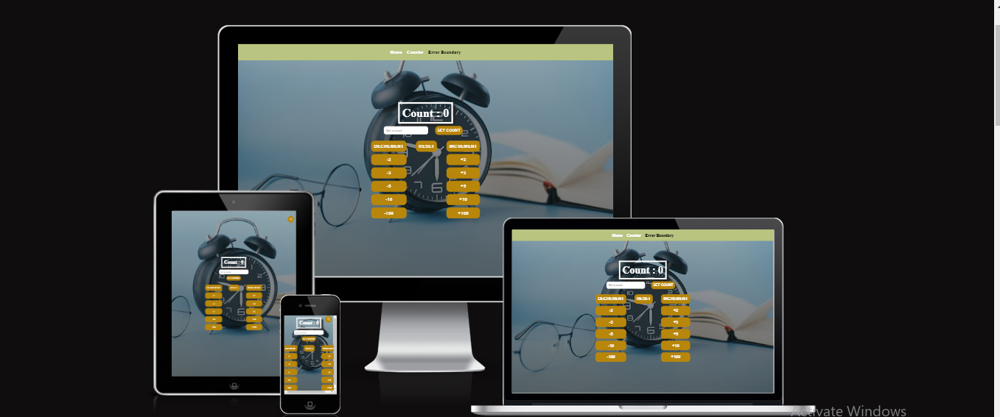

# CountDApp Application

> This is an AltSchool Examination project that deals with a counter application using custom hook useReducer, testing error boundaries, error pages with good SEO

# Application Screenshot



## Built With

- ReactJs
- Deploy with Netlify

## Live Demo

[Live Demo Link](https://countdapp.netlify.app/)

### Development (Running locally)

- Clone the project

```bash
git clone https://github.com/was-coder/professional-portfolio.git

```

- Install Dependencies

```bash
npm install
```

To run app:

```bash
npm start
```

## Style Guides

- [React Style Guide](https://dev.to/abrahamlawson/react-style-guide-24pp)
- [Git Style Guide](https://udacity.github.io/git-styleguide/)

## 👤 Author

- Github: [@was-coder](https://github.com/was-coder)
- Twitter: [@DevWaslead](https://twitter.com/DevWaslead)
- Linkedin: [@Adelakun-Wasiu](https://www.linkedin.com/in/adelakun-wasiu-1a2a5b1a6/)

## 🤝 Contributing

Contributions, issues and feature requests are welcome!

Feel free to check the [issues page](../../issues).

## Show your support

Give a ⭐️ if you like this project!

## Acknowledgments

- https://github.com/adejam/html-and-css-templates/blob/main/README.md

## 📝 License

[MIT licensed](./LICENSE).
